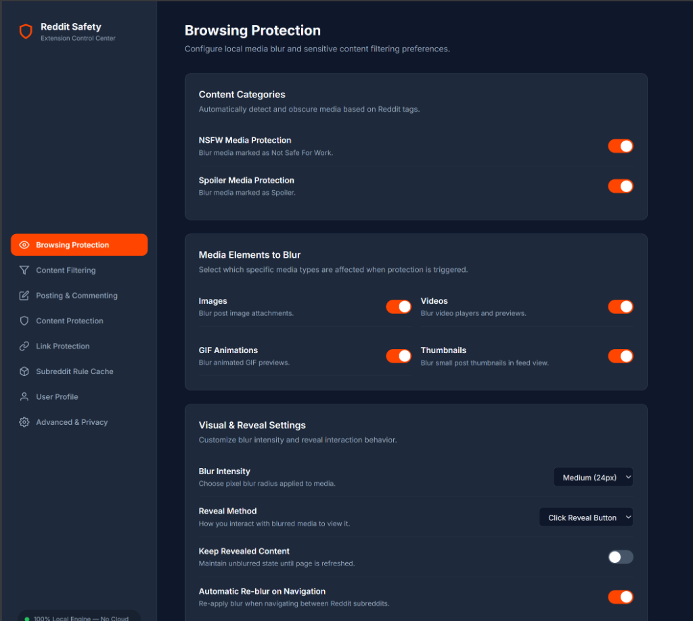
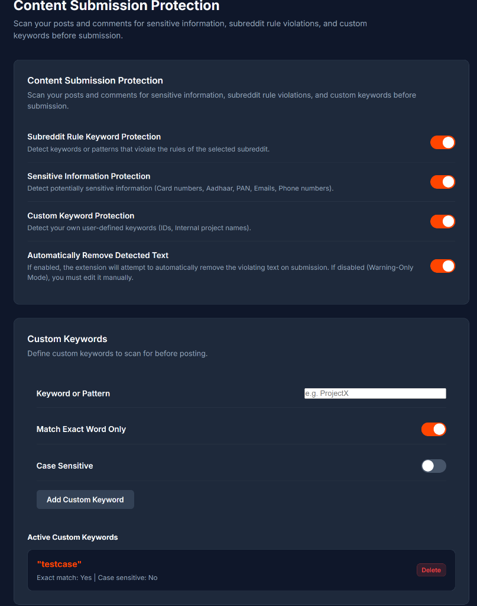
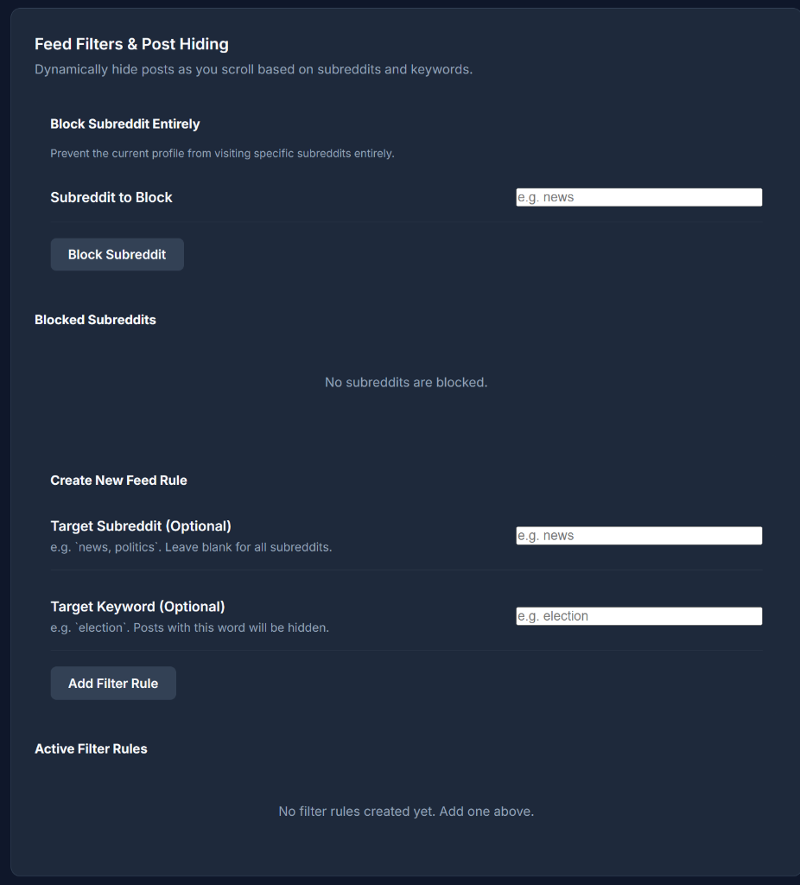
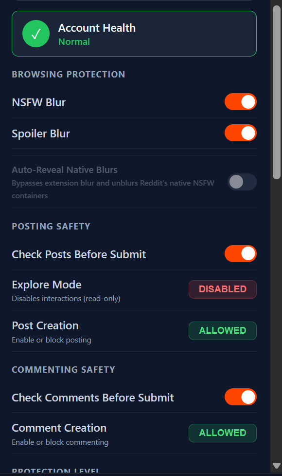
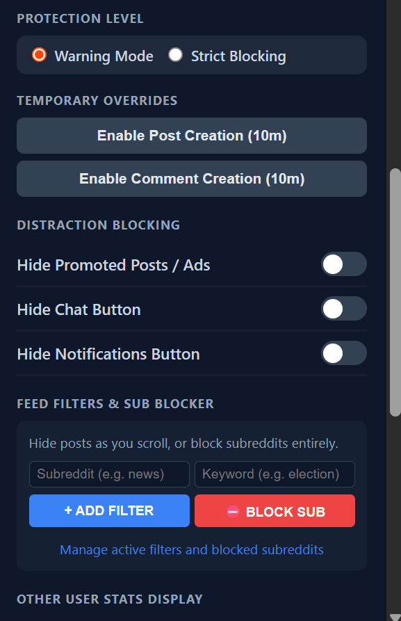

# Cloakly

A powerful browser extension designed to enhance your Reddit experience by giving you granular control over content visibility, auto-revealing natively blurred content, and providing an intuitive set of privacy options.

## Features

- **Multi-Account Profiles:** Settings are saved on a per-account basis. When you switch Reddit accounts, your personalized safety configurations switch with you instantly.
- **Explore Mode (Read-Only):** Aggressively blocks and hides all interaction buttons (Upvote, Downvote, Comment, Share) to prevent accidental engagement while scrolling.
- **Granular Interaction Blocks:** Lock down your account by individually allowing or blocking Post Creation and Comment Creation.
- **Pre-Submission Safety Checker:** Checks community rules, Account Age, and Karma requirements *before* you post or comment, warning you of potential rejections. Now strictly enforces missing Tags and Post Flairs.
- **Inline User Stats Badge:** Shows quick, beautiful stats badges (Karma & Account Age) directly next to other users' names in your feed, comment section, and chat without needing to visit their profile. Fully customizable via the popup.
- **Distraction Blocking (Zen Mode):** Keep your feed clean by hiding annoying elements like Promoted Posts (Ads), the Chat button, and the Notifications inbox.
- **Shadowban & Ghosting Detector:** Automatically checks if your account is shadowbanned, and detects if your posts were silently ghosted (removed) by Reddit filters.
- **Feed Filters & Subreddit Blocker:** Dynamically hide posts containing specific keywords, or completely block access to specific subreddits. Includes inline "⛔ Block Subreddit" buttons injected seamlessly into your feed and subreddit headers for instant one-click blocking.
- **Custom Content Blurring:** Toggle blurs for NSFW and Spoiler posts individually.
- **Auto-Reveal Native Blurs:** Automatically unblur Reddit's native NSFW and Spoiler images as you scroll, bypassing Reddit's strict click blocks.
- **Account Nuke / Cleaner:** Permanently wipes your account history (Posts, Comments, Saved items, Upvotes, Downvotes) based on custom time ranges (Last hour, 24h, 7d, 30d, 1y, or custom dates).

## Screenshots

  
  

  
  
  

## Credits & Acknowledgements

Special thanks to [andradeatdev's Reddit-NSFW-Unblur](https://github.com/andradeatdev/Reddit-NSFW-Unblur) repository! 
Their brilliant discovery of manipulating Lit Web Component reactive properties (such as `.blurred = false`) was the key to bypassing Reddit's strict native click requirements and making the Auto-Reveal feature robust and smooth.

## Installation Instructions

### For Chrome / Edge / Brave

1. Download or clone this repository to your computer.
2. Open your browser and navigate to the Extensions page:
   - **Chrome:** `chrome://extensions/`
   - **Edge:** `edge://extensions/`
   - **Brave:** `brave://extensions/`
3. Enable **Developer Mode** (usually a toggle switch in the top-right corner).
4. Click the **"Load unpacked"** button.
5. Select the folder containing the extension files (the root folder where `manifest.json` is located).
6. The extension is now installed! You can pin it to your toolbar for easy access.

### For Firefox

1. Download or clone this repository to your computer.
2. Open Firefox and navigate to `about:debugging#/runtime/this-firefox`.
3. Click on the **"Load Temporary Add-on..."** button.
4. Navigate to the extension folder and select the `manifest.json` file.
5. The extension is now temporarily loaded and will remain active until you restart Firefox.

## Contributing
Feel free to open issues or submit pull requests for bug fixes and feature enhancements!

## Developer Notes
If you are looking to contribute or understand the technical architecture behind features like bypassing Reddit's React/Lit components across different browser security sandboxes (Chrome MV3 vs Firefox Xray Vision), please read our [DEV_NOTES.md](DEV_NOTES.md).

## License and Disclaimer

### Dual-License (MIT / Commercial)
This extension is licensed under the **MIT License** for all personal, non-commercial, and open-source use. 

**For any business, commercial, or enterprise use** (including but not limited to incorporating the extension or any part of its code into a commercial product, using it for commercial automation, or distributing it for profit), a separate commercial license is required. Please contact the repository owner via this GitHub repository to obtain a commercial license.

See the [LICENSE.md](LICENSE.md) file for full details.

### Disclaimer
**Use at Your Own Risk:** This extension automates actions and modifies content on Reddit. The authors are not responsible for any account bans, suspensions, data loss, or other consequences that may arise from the use of this software. 

**Not Affiliated with Reddit:** This project is independent and is not affiliated with or endorsed by Reddit Inc.; all third-party names, trademarks, logos, and assets belong to their respective owners.
